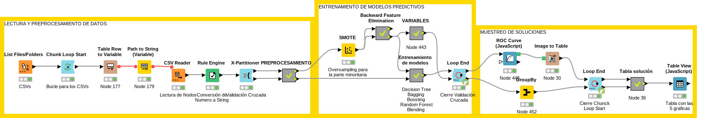

# 📊 Análisis de Datos Económicos de Empresas en Quiebra en Polonia

Proyecto de **Minería de Datos** desarrollado en **KNIME Analytics Platform** cuyo objetivo es predecir la quiebra empresarial utilizando información financiera histórica de empresas polacas.

---

## 👤 Autor

**Guillermo Luna Freytas**  
DNI: 29551414W  

---

## 📌 Contexto

El análisis de la viabilidad económica y la predicción de quiebra empresarial representa un desafío clave en la toma de decisiones financieras.

Este proyecto se centra en el mercado empresarial polaco, caracterizado por fluctuaciones económicas derivadas de cambios legislativos, financieros y del entorno internacional.

Predecir la quiebra de empresas permite:

- Reducir riesgos financieros
- Ayudar a inversores en la toma de decisiones
- Facilitar estrategias preventivas para instituciones públicas y privadas

---

## 🎯 Objetivo del negocio

Desarrollar un **modelo predictivo** capaz de anticipar si una empresa entrará en quiebra en un horizonte temporal de **1 a 5 años**, utilizando datos financieros históricos.

---

## ⏱️ Estimación del proyecto (CRISP-DM)

| Fase CRISP-DM | Horas |
|---|---|
| Comprensión del proyecto | 3 h |
| Comprensión de los datos | 2 h |
| Preparación de datos | 1 h |
| Diseño del modelo | 25 h |
| Evaluación | 3 h |
| Despliegue e informe | 6 h |
| **Total** | **40 h** |

---

## 📁 Descripción de los datos

Se utilizaron **5 archivos CSV**, cada uno correspondiente a:

- 1 año antes de la quiebra
- 2 años antes
- 3 años antes
- 4 años antes
- 5 años antes

Cada dataset contiene:

- 64 atributos financieros
- Variable objetivo binaria:
  - `1` → Empresa en quiebra
  - `0` → Empresa activa

---

## 🧹 Preparación de los datos

### 🔹 División por clase (Row Splitter)
- Separación entre empresas en quiebra y no quiebra.
- Permite aplicar tratamientos diferenciados.

### 🔹 Tratamiento de valores faltantes
- Eliminación de missings.
- Evita sesgos y mejora el rendimiento predictivo.

### 🔹 Tratamiento de Outliers
- Identificación y corrección de valores atípicos.
- Mejora la robustez del modelo.

### 🔹 Normalización
- Escalado de valores entre **0 y 1**.
- Mejora la convergencia de los algoritmos.

---

## 🤖 Técnicas Predictivas Utilizadas

### ✔ Backward Feature Selection
- Reduce el número de variables.
- Modelo base: **Naïve Bayes**.

### ✔ Decision Tree + Parameter Optimization
- Árbol de decisión optimizado.
- Quality Measure: **Gini Index**.

### ✔ Boosting
- Mejora la precisión combinando modelos.
- Quality Measure: **Gain Ratio**.
- Iteraciones: **3 modelos**.

### ✔ Bagging
- Reduce el sobreajuste mediante subconjuntos de datos.
- Quality Measure: **Gain Ratio**.
- Iteraciones: **5 modelos**.

### ✔ Random Forest
- Reduce el overfitting.
- Alta robustez y precisión.
- Quality Measure: **Gain Ratio**.
- **50 árboles**.

### ✔ Blending
- Combina predicciones de varios modelos.
- Resultado final basado en la **media de predicciones**.

---

## ✅ Técnicas de Validación

### Validación Cruzada
- **10-Fold Cross Validation**
- Estimación robusta del rendimiento general.
- Previene el sobreajuste.

---

## 📈 Técnicas de Evaluación

### Curva ROC
- Evalúa la capacidad de distinguir entre:
  - Empresas en quiebra
  - Empresas activas

### Scorer
Permite obtener:

- Matriz de confusión
- Accuracy
- F1-Score (métrica principal)

El valor positivo considerado es:

---

## 🚀 Despliegue

Se utilizó el nodo:

**Table View (JavaScript)**

Para visualizar:

- Año analizado
- Variables seleccionadas
- Curvas ROC
- Resultados predictivos

Proporciona una visualización interactiva que facilita el análisis comparativo.

---

## 📊 Resultados

### Resultados Analíticos
- Comparación del rendimiento entre los 5 modelos.
- Evaluación en distintos horizontes temporales.

### Resultados del Modelo
- Todos los modelos presentan rendimiento superior a **0.5**.
- El enfoque se centra en detectar correctamente la **quiebra empresarial**.

### Aplicación Real
El modelo puede emplearse como:

- Sistema de alerta temprana para bancos
- Herramienta de apoyo a inversores
- Base para políticas económicas preventivas

---

## 🔧 Posibles Mejoras

- Automatización completa del workflow.
- Adaptación a nuevos datasets sin intervención manual.
- Integración en pipelines productivos de análisis financiero.

---

## 🛠️ Tecnologías Utilizadas

- KNIME Analytics Platform
- CRISP-DM
- Machine Learning
- Data Mining
- Validación Cruzada
- Modelos Ensemble

---

## 📂 Contenido del Repositorio

https://drive.google.com/drive/folders/1LzlcHMzhtMMepWONXYqSqBcEHxqKQtEq?usp=drive_link

---

## 📂 Workflow de Knime

  

